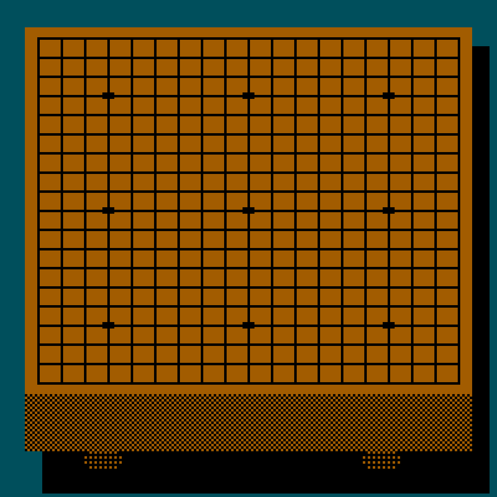
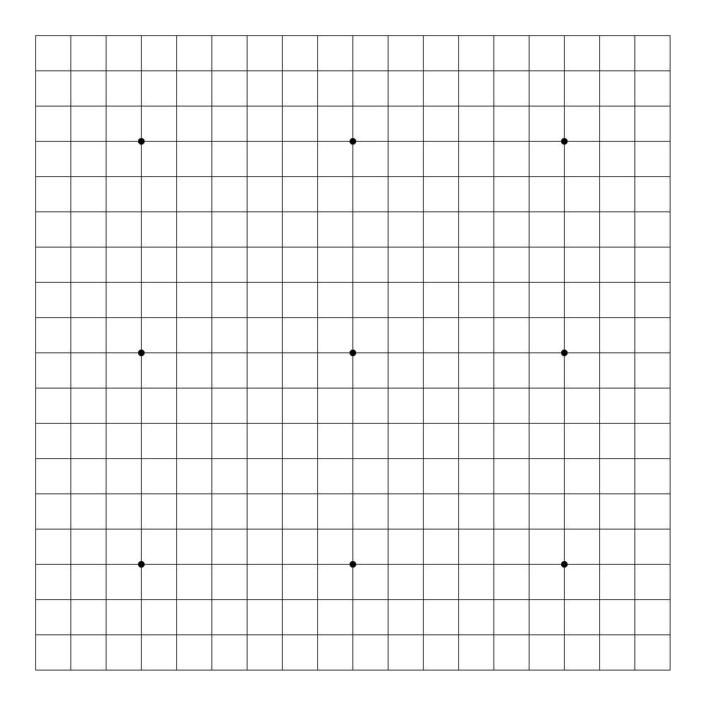

# sgf2gif
A program that converts an SGF-file to an animated GIF.

The animated GIF is highly inspired by the classic game Hayauchi Super Igo for NES.

```shell
Usage: sgf2gif options_list
Options:
    --file, -f -> The SGF-file to convert to a GIF. If not stated, the SGF will be read from the std-in.
    --output, -o -> The destination file to write the GIF to. If not stated, the output will be written to std-out.
    --theme [NES] -> The theme to render the board with { Value should be one of [nes, classic] }
    --loop, -l [false] -> Whether the animation should be looped or not
    --show-marker [false] -> Whether the last move should be marked or not
    --width, -w [1000] -> The width of the image. { Int }
    --height, -h [1000] -> The height of the image. { Int }
    --move-number, -mn [2147483647] -> The move number up to which the animation will run to. { Int }
    --delay, -d [2] -> The delay between frames in seconds. { Int }
    --help -> Usage info
```

### NES theme
```shell
java -jar sgf2gif.jar -f ~/game.sgf -o ~/game.gif --theme nes
```


### Classic theme
```shell
java -jar sgf2gif.jar -f ~/game.sgf -o ~/game.gif --theme classic
```


### Writing to std-out
By omitting the --output command, the GIF file will be written to std-out.
```shell
java -jar sgf2gif.jar -f ~/game.sgf > ~/game.gif
```

### Reading from std-in
By omitting the --file command, the SGF will be taken from the std-in
```shell
java -jar sgf2gif.jar < ~/game.sgf > ~/game.gif
```

### Showing markers
By adding the --show-marker flag, each move made in the animation will have a marker on it
```shell
java -jar sgf2gif.jar < ~/game.sgf > ~/game.gif --show-marker
```
